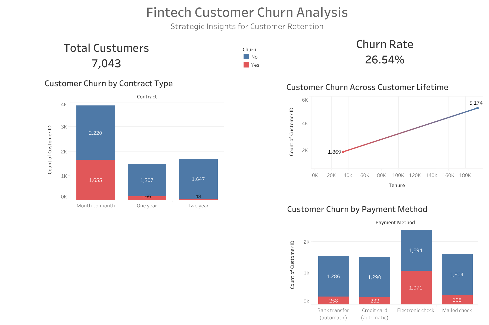
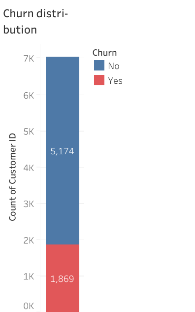
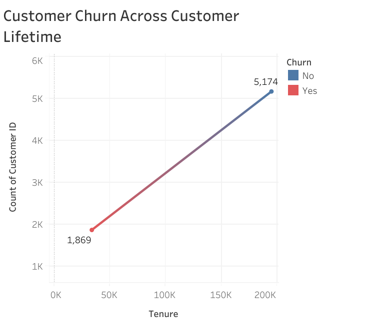
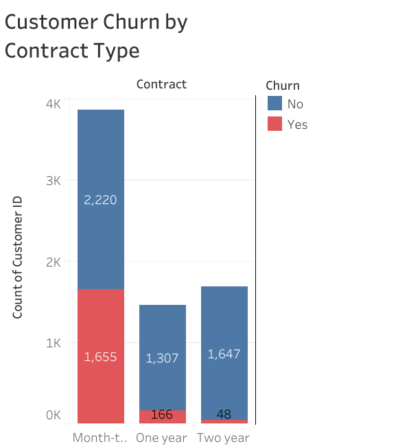

# Predictive Customer Churn Analysis in African Fintech

---

## Executive Summary

Customer retention represents one of the most critical growth drivers for fintech companies operating in African digital financial ecosystems.

In markets characterized by high competition, low switching costs, and strong price sensitivity, customer churn can significantly impact long-term profitability.

This project applies predictive analytics and behavioral segmentation techniques to identify churn drivers and support the development of data-driven customer retention strategies.

The analysis combines exploratory data analysis, feature engineering, machine learning models, and interactive dashboards to deliver actionable strategic insights.

---

# 1. Business Context

African fintech markets are experiencing rapid expansion driven by:

- Mobile financial services adoption  
- Increasing digital payment penetration  
- Expanding financial inclusion initiatives  
- Rapid growth of digital banking platforms  

Despite strong customer acquisition rates, many fintech companies face challenges related to **customer retention and engagement stability**.

High churn rates often result from:

- low switching barriers  
- competitive pricing pressure  
- weak differentiation between services  

Improving retention can significantly increase **Customer Lifetime Value (CLV)** and revenue stability.

---

# 2. Business Problem

The central question addressed in this project is:

**How can predictive analytics identify customers at risk of churn and enable targeted retention strategies?**

Specifically, the analysis aims to:

- identify behavioral patterns associated with churn  
- quantify the influence of engagement and service usage  
- develop predictive models capable of detecting churn risk  
- generate strategic insights supporting retention optimization  

---

# 3. Data & Methodology

## Data Preparation

The dataset was prepared using **R and the tidyverse ecosystem**, including:

- Data cleaning and transformation  
- Handling missing values  
- Standardizing categorical variables  
- Feature scaling where appropriate  

## Feature Engineering

Several strategic variables were created to improve predictive performance:

**Engagement Score**

A composite behavioral metric combining:

- customer tenure  
- transaction activity  
- service usage intensity  

**Early Risk Flag**

Identifies customers displaying high churn probability during early lifecycle stages.

**Service Usage Depth**

Measures the number of activated platform services.

These features allow the model to capture **customer behavioral dynamics** beyond basic demographic attributes.

---

# 4. Exploratory & Visual Insights

The exploratory analysis was conducted using **R Markdown**, while interactive visualizations were developed with **Tableau**.

## 4.1 Customer Churn Distribution

Customer churn represents a substantial portion of the total customer base.

This highlights retention instability within highly competitive fintech environments where switching costs remain low.

### Strategic Implication

Even marginal improvements in retention could produce significant revenue gains through improved customer lifetime value.

---

## 4.2 Customer Lifetime vs Churn

Analysis reveals that churn is strongly concentrated among **low-tenure customers**.

### Interpretation

Customers within the first months of usage often exhibit weaker engagement and limited integration with platform services.

### Strategic Implication

Fintech companies should prioritize early lifecycle retention strategies such as:

- structured onboarding programs  
- guided product discovery  
- early usage incentives  
- behavioral monitoring during initial customer interactions  

---

## 4.3 Contract Type vs Churn

Customers using **monthly subscription contracts** show significantly higher churn rates compared to those subscribed to long-term plans.

### Interpretation

Lower contractual commitment reduces switching barriers and increases customer mobility between competing fintech platforms.

### Strategic Implication

Retention strategies could include:

- annual subscription incentives  
- loyalty reward programs  
- bundled financial services  
- duration-based pricing benefits  

---

## 4.4 Payment Method vs Churn

Customers using **automated payment methods** demonstrate stronger retention compared to customers using manual payment processes.

### Interpretation

Automated payments reduce transaction friction and ensure continuous service usage.

### Strategic Implication

Fintech platforms should encourage automated payments through:

- cashback incentives  
- onboarding prompts  
- simplified automatic billing activation

  ## 4.5 Interactive Dashboard

  The interactive strategic dashboard is available here:
  
  https://public.tableau.com/authoring/FintechCustomerChurnStrategicAnalysis/Fintech_Churn_Strategy_Dashboard#1

---

# 5. Predictive Modeling

Two machine learning models were developed to predict churn probability.

## Logistic Regression

Logistic regression served as an interpretable baseline model, enabling identification of statistically significant churn drivers.

## Random Forest

A Random Forest classifier was trained to capture non-linear behavioral relationships between engagement metrics and churn outcomes.

The model demonstrated stronger predictive performance compared to logistic regression.

---

# 6. Model Evaluation

Model performance was evaluated using:

- ROC Curve  
- AUC Score  
- Confusion Matrix  
- Precision and Recall metrics  

The Random Forest model achieved strong discrimination capability between churners and non-churners.

Key predictive drivers include:

- customer tenure  
- engagement score  
- service usage depth  

---

# 7. Key Findings

The analysis produced several important insights:

- Churn is strongly concentrated among early-stage customers.  
- Low engagement significantly increases churn probability.  
- Automated payment usage improves retention stability.  
- Behavioral engagement metrics provide strong predictive power.  

These findings highlight the importance of **behavior-driven customer management strategies**.

---

# 8. Strategic Recommendations

Based on the analytical findings, several retention strategies are recommended:

### 1. Reinforce Early Customer Onboarding

The first 90 days represent the highest churn risk period.

Implement structured onboarding journeys and early engagement incentives.

### 2. Deploy Behavioral Engagement Scoring

Use engagement scores to identify at-risk customers and trigger proactive retention campaigns.

### 3. Promote Automated Payment Adoption

Encourage automatic billing mechanisms to reduce service discontinuity.

### 4. Develop Loyalty and Long-Term Subscription Programs

Introduce benefits linked to contract duration and long-term service usage.

---

# 9. Business Impact Simulation

Reducing churn by **5%** could generate significant strategic benefits:

- Increased customer lifetime value  
- Improved revenue predictability  
- Lower customer acquisition pressure  
- Stronger competitive positioning  

Retention improvements therefore represent a **high-leverage growth opportunity** for fintech platforms.

---

# 10. Tools & Technologies

This project combines multiple analytical technologies:

- R
- R Markdown
- Python
- Machine Learning
- Tableau
- SQL

These tools enable a complete data analytics workflow from exploration to strategic decision support.

---

# Author

Franck Djandja   
Data Analyst | Predictive & Business Analytics  
Industry  Africa Focus

---
